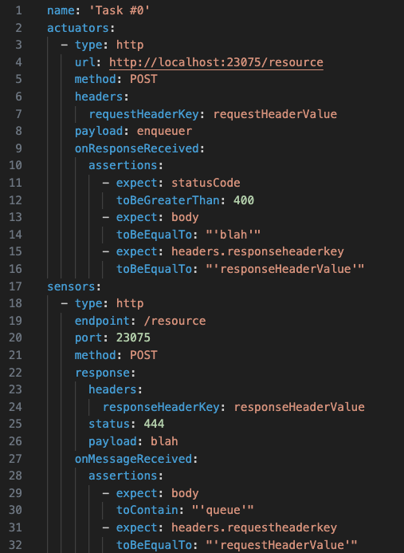

## Why
Make sure your set of services is working properly by mocking its inputs and asserting against
its outputs

## What
Enqueuer is a platform that provides the following capabilities:
- Support for multi protocols 
- Chainable message flows  
- Friendly for developers and non developers  
- Easily extensible through third party <a
    href="http://github.com/enqueuer-land/plugins-list">plugins</a>, including <a
    href="https://github.com/enqueuer-land/plugin-scaffold">yours</a>  
- Automated end-to-end testing  
- Place tests front and center

## How

[Check out the full documentation](https://enqueuer.com/docs)
